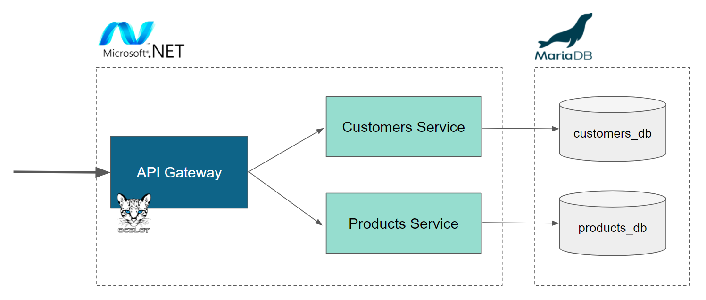

# Microservice Example using .NET and MariaDB

This repository provides a simple example of a microservice architecture using a [Microsoft .NET](https://dotnet.microsoft.com/en-us/learn/dotnet/what-is-dotnet) solution that contains:

* Two microservice ([Web API](https://dotnet.microsoft.com/en-us/apps/aspnet/apis)) projects 
* One API Gateway project


<p align="center" spacing="10">
    <kbd>
        
    </kbd>
</p>

# Table of Contents
1. [Requirements](#requirements)
2. [Introduction to MariaDB](#introduction)
    1. [MariaDB](#platform)
    2. [MariaDB in the cloud](#skysql)
3. [Getting started](#get-started)
    1. [Get the code](#code)
    2. [Create the schema](#schema)
    3. [Anatomy of the app](#app)
    4. [Confifgure the application](#config)
    5. [Build and run the app](#build-run)
4. [Requirements to run the app](#requirements)
5. [Support and contribution](#support-contribution)
6. [License](#license)

## Requirements <a name="requirements"></a>

This sample application will require the following to be installed on your machine:

* [.NET 6](https://dotnet.microsoft.com/en-us/download/dotnet/6.0)
* [Visual Studio 2022](https://visualstudio.microsoft.com/vs/)
* [MariaDB command-line client](https://mariadb.com/products/skysql/docs/clients/) (optional), used to connect to and query MariaDB databases.

## Introduction to MariaDB <a name="introduction"></a>

### MariaDB <a name="platform"></a>

[MariaDB Platform](https://mariadb.com/products/mariadb-platform/) integrates [transactional](https://mariadb.com/products/mariadb-platform-transactional/) and [analytical](https://mariadb.com/products/mariadb-platform-analytical/) products so developers can build modern applications by enriching transactions with real-time analytics and historical data, creating insightful experiences and compelling opportunities for customers – and for businesses, endless ways to monetize data. 

<p align="center" spacing="10">
    <kbd>
        
    </kbd>
</p>

To get started using MariaDB locally you can choose one of the following options:

* [Download and install MariaDB (Community or Enterprise) directly from mariadb.com](https://mariadb.com/downloads) 

* [Download and install MariaDB using the official MariaDB Community Server 10.6 Docker Image available at hub.docker.com](https://hub.docker.com/_/mariadb)

### MariaDB in the cloud <a name="skysql">

[SkySQL](https://mariadb.com/products/skysql/) is the first and only database-as-a-service (DBaaS) to bring the full power of MariaDB Platform to the cloud, including its support for transactional, analytical and hybrid workloads. Built on Kubernetes, and optimized for cloud infrastructure and services, SkySQL combines ease of use and self-service with enterprise reliability and world-class support – everything needed to safely run mission-critical databases in the cloud, and with enterprise governance.

[Get started with SkySQL!](https://mariadb.com/skyview)

<p align="center" spacing="10">
    <kbd>
        
    </kbd>
</p>

## Get started <a name="get-started"></a>

In order to run the TODO application you will need to have a MariaDB instance to connect to. For more information please check out "[Get Started with MariaDB](https://mariadb.com/get-started-with-mariadb/)".

### Get the code <a name="code"></a>

Download this code directly or use [git](git-scm.org) (through CLI or a client) to retrieve the code using `git clone`:

```
$ git clone https://github.com/mariadb-corporation/dev-example-microservices-dotnet.git
```

### Create the schema <a name="schema"></a>

[Connect to the database](https://mariadb.com/kb/en/connecting-to-mariadb/) and execute the following SQL scripts using the following options:

1.) Using the MariaDB command-line client to execute the SQL contained within [schema.sql](schema.sql).

_Example command:_
```bash
$ mariadb --host HOST_ADDRESS --port PORT_NO --user USER --password PASSWORD < schema.sql
```

2.) Copying, pasting and executing the scripts contained in [schema.sql](schema.sql) using a client of your choice.

```sql
CREATE DATABASE customer_db;

 CREATE TABLE customer_db.`customers` (
  `id` int(11) unsigned NOT NULL AUTO_INCREMENT,
  `name` varchar(100) NOT NULL,
  `email` varchar(50) NOT NULL,
  PRIMARY KEY (`id`)
) ENGINE=InnoDB;

CREATE DATABASE product_db;

CREATE TABLE product_db.`products` (
  `id` int(11) unsigned NOT NULL AUTO_INCREMENT,
  `name` varchar(100) NOT NULL,
  `description` varchar(50) NOT NULL,
  PRIMARY KEY (`id`)
) ENGINE=InnoDB;
```

### Anatomy of the app <a name="app"></a>

This application is made of three parts:

* [Customers.API](Customers.API) - a .NET 6 REST project that uses [Entity Framework 6](https://docs.microsoft.com/en-us/ef/ef6/) to connect to and communicate with an underlying MariaDB database.
* [Products.API](Products.API) - a .NET 6 REST project that uses [Entity Framework 6](https://docs.microsoft.com/en-us/ef/ef6/) to connect to and communicate with an underlying MariaDB database.
* [Gateway.API](Gateway.API) - a .NET project that uses [Ocelot](https://github.com/ThreeMammals/Ocelot) to function as an API gateway for the Customers.API and Products.API microservices.

### Confifgure the application to use your MariaDB database <a name="config"></a>

For the `Customers.API` and `Products.API` microservice projects to use your MariaDB database they must first be configured. The projects already contain connection strings, but depending on your setup you may need to update them.

To do that, update the connection string configuration in the projects' appsettings.json files:

* [Customers.API appsettings.json](Customers.API/appsettings.json)
* [Products.API appsettings.json](Products.API/appsettings.json)

### Build and run the app <a name="build-run"></a>

Depending on how you've setup your environment you may have the option to build and run .NET solutions using:

* [Visual Studio](https://docs.microsoft.com/en-us/visualstudio/ide/walkthrough-building-an-application?view=vs-2022) - build and run the solution by first opening the [Demo.sln file](Demo.sln]) using the Visual Studio IDE
* [dotnet CLI](https://docs.microsoft.com/en-us/dotnet/core/tools/dotnet-run) - build and run the solution by using the dotnet command with the [Demo.sln file](Demo.sln).

## Support and Contribution <a name="support-contribution"></a>

Thanks so much for taking a look at this sample app! As this is a simple example, there's plenty of potential for improvement and customization. Please feel free to submit PR's to the project to include your modifications!

If you have any questions, comments, or would like to contribute to this or future projects like this please reach out to us directly at [developers@mariadb.com](mailto:developers@mariadb.com) or on [Twitter](https://twitter.com/mariadb).

## License <a name="license"></a>
[](https://opensource.org/licenses/MIT)
